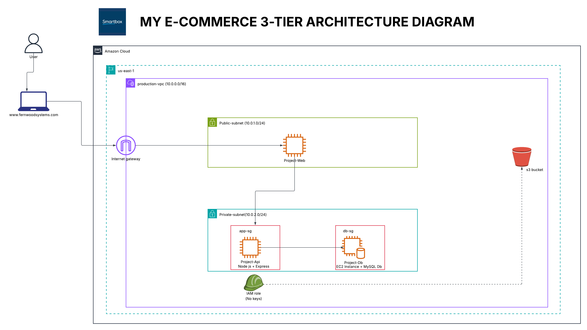

# Session 23 – Building a Three-Tier App on AWS

**Name:** Precious Nwafor  
**Project:** E-Commerce Three-Tier Architecture on AWS

---

## What Was Built

A fully functional **three-tier web application** deployed on AWS, consisting of:

| Tier | Technology | Instance |
|------|-----------|---------|
| **Web Tier** | React + NGINX reverse proxy (Ubuntu) | PROJECT-WEB |
| **App / API Tier** | Node.js + Express (Ubuntu) | PROJECT-API |
| **Database Tier** | MySQL (Ubuntu) | PROJECT-DB |

The application allows users to add records through a web interface, which are saved successfully to the database — proving end-to-end connectivity across all three tiers.

An **S3 bucket** was also provisioned, with an IAM Role attached to the PROJECT-API instance, enabling secure S3 access without access keys (`aws s3 ls` confirmed working).

---

## Architecture Diagram

The diagram shows:
- A **production-vpc (10.0.0.0/16)** in the `us-east-1` region
- A **public subnet (10.0.1.0/24)** containing PROJECT-WEB (React + NGINX), accessible via the Internet Gateway
- A **private subnet (10.0.2.0/24)** containing PROJECT-API and PROJECT-DB, with no direct internet access
- **app-sg** security group wrapping PROJECT-API, allowing traffic on port 3000 from the web tier
- **db-sg** security group wrapping PROJECT-DB, allowing MySQL traffic on port 3306 from app-sg only
- **PROJECT-DB** as an EC2 instance with MySQL installed directly (not Amazon RDS)
- An **Internet Gateway** routing external traffic from `www.fernwoodsystems.com` to the web tier
- An **IAM Role (no access keys)** attached to PROJECT-API, granting secure access to the **S3 bucket** outside the VPC

---

## Setup Steps (In Order)

### 1. VPC & Networking
1. Created the VPC (`production-vpc`)
2. Created public and private subnets
3. Created and attached an Internet Gateway to the VPC
4. Created a Route Table and associated it with the public subnet
5. Added a route with the Internet Gateway as the target
6. Left the private subnet on the default route table

### 2. Security Groups
7. Created `app-sg` security group (for the App/API tier)
8. Created `db-sg` security group (for the Database tier)

### 3. EC2 Instances
9. Launched **PROJECT-WEB** EC2 instance (Web Tier)
10. Launched **PROJECT-API** EC2 instance (App/API Tier)
11. Launched **PROJECT-DB** EC2 instance (Database Tier)

### 4. Database Tier Configuration
12. Configured **MySQL** on PROJECT-DB (Ubuntu)

### 5. App / API Tier Deployment
13. Deployed **Node.js + Express** on PROJECT-API (Ubuntu)
14. Connected PROJECT-API to the database

### 6. Web Tier Deployment
15. Deployed **React + NGINX** reverse proxy on PROJECT-WEB (Ubuntu)

### 7. End-to-End Validation
16. Added a record through the website — saved successfully ✅

### 8. S3 & IAM
17. Created an S3 bucket
18. Attached an IAM Role to PROJECT-API
19. Confirmed `aws s3 ls` works with zero access keys ✅

---

## Screenshots

> _Screenshots added are below_

1. VPC created (`production-vpc`)
2. Public and private subnets
3. Internet Gateway attached
4. Route Table with IGW route
5. `app-sg` and `db-sg` security groups
6. All three EC2 instances running (PROJECT-WEB, PROJECT-API, PROJECT-DB)
7. MySQL configured on PROJECT-DB
8. Node.js + Express running on PROJECT-API
9. PROJECT-API connected to the database
10. React app loaded in browser
11. Record added via the web UI — saved successfully
12. `aws s3 ls` output (no access keys)

---

## Key Learnings

- How to architect a **three-tier application** with proper network segmentation (public/private subnets)
- The role of **Security Groups** in controlling traffic between tiers
- How **IAM Roles** allow EC2 instances to access AWS services without hardcoded credentials
- How **NGINX** acts as a reverse proxy to route web traffic to the backend API
- How a **React frontend**, **Node.js API**, and **MySQL database** connect across separate EC2 instances
